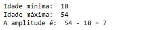

# Teoria e Prática

- Revendo os conceitos da disciplina de Estatística I e II que tive na faculdade
- Colocando em prática as teorias em dados reais
- Vou usar o livro Estatística Aplicada do autor Ron Larson
- O objetivo vai ser entender Estatística tanto na teoria e como conseguir aplicar
- As partes das ferramenta de analise de dados (BI, Python, SQL e etc) não é o objetivo a priori
- Em outros projetos vou documentar meus estudos nessas ferramentas
  

## Parte I: Estatística Descritiva

### Distribuições de frequência e seus gráficos

#### Distribuições de frequência

Definição: É uma tabela que mostra classes ou intervalos dos valores com a contagem do número de ocorrências em cada classe ou intervalo.
Cada classe tem um limite inferior e superior, onde o inferior é o menor número que pode pertencer à classe e o superior que é o maior número
que pode pertencer a classe.
A amplitude de classe é a distância entre os limites inferiores e superiores.
O código abaixo vai mostrar isso. Utilizando dados da idade de Estudantes da UFG do curso Gestão da Informação.

``` # Determine o número de classes
num_classe = 5

# Determine o valor mínimo e máximo
valor_minimo = df['idade'].min()
valor_maximo = df['idade'].max()

# Determine a amplitude da classe
amplitude = (valor_maximo - valor_minimo) / num_classe

# Arredonde a amplitude para baixo
amplitude_arredondada = math.floor(amplitude)

print('Idade mínima: ', valor_minimo)
print('Idade máxima: ', valor_maximo)
print('A amplitude é: ' , valor_maximo , '-' , valor_minimo , '=' , amplitude_arredondada)
```




O valor mínimo é um limite inferior conveniente para a primeira 
classe. Para encontrar os limites inferiores das 5 classes restantes, 
adicione a amplitude de classe, 7, ao limite inferior de cada classe precedente. Logo, os limites inferiores das demais classes são: 18+ 7 = 25, 25 + 7 = 32, e assim por diante. A tabela abaixo vai mostrar como fica a frequência de idades dos estudantes de Gestão da Informação da UFG.
Observação: Dados de até 2018.

```
# Crie os intervalos de classe
intervalos = [valor_minimo + i * amplitude_arredondada for i in range(num_classe + 1)]

# Use pd.cut() para criar as classes e atribuir cada idade a uma classe
df['classe_idade'] = pd.cut(df['idade'], bins=intervalos, include_lowest=True)

# Use value_counts() para contar a frequência de cada classe
tabela_frequencia = df['classe_idade'].value_counts().sort_index().reset_index()

# Renomeie as colunas para "Classe de Idade" e "Frequência"
tabela_frequencia.columns = ['Classe de Idade', 'Frequência']

# Exiba a tabela de frequência
print(tabela_frequencia)

```


